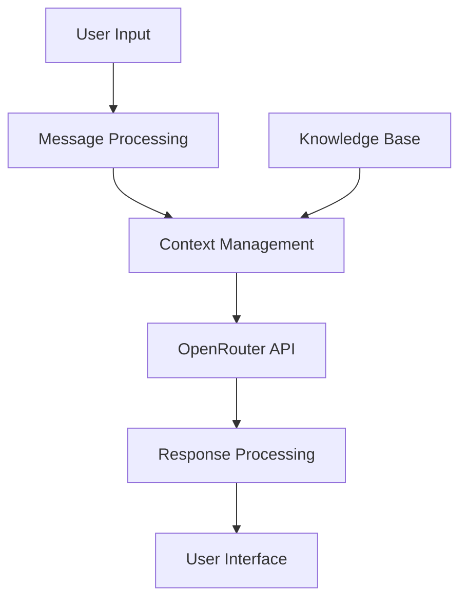

# Building Chatbots with OpenRouter

This guide covers best practices, implementation patterns, and techniques for building effective AI chatbots using OpenRouter's unified API.

## Chatbot Architecture

A well-designed chatbot architecture typically includes:

1. **User Interface** - The frontend that users interact with
2. **Message Processing** - Logic to handle incoming messages
3. **Context Management** - Storing and maintaining conversation state
4. **LLM Integration** - Connecting to OpenRouter for AI responses
5. **Post-Processing** - Formatting and validating responses
6. **Knowledge Base** - Optionally retrieving relevant information



## Choosing the Right Models

Different models excel at different aspects of chatbot functionality:

| Model | Strengths | Best For |
|-------|-----------|----------|
| GPT-4o | Creative, coherent, follows instructions well | General-purpose chatbots, complex tasks |
| Claude 3 Opus | Detailed, factual, lengthy reasoning | Knowledge-heavy applications, reasoning tasks |
| Claude 3 Sonnet | Good balance of quality and cost | Production chatbots with moderate complexity |
| GPT-3.5 Turbo | Fast, cost-effective | Simple chatbots, high-volume use cases |
| Llama 3 | Open source, privacy-focused | On-premises deployment, privacy-sensitive use cases |

## Implementing Memory

Chatbots require context management to maintain conversation flow:

### Message Context Window

```javascript
// Building a conversation array for context
const messages = [
  { role: "system", content: "You are a helpful customer service assistant." },
  { role: "user", content: "I need help with my order." },
  { role: "assistant", content: "I'd be happy to help with your order. Could you provide your order number?" },
  { role: "user", content: "It's OR-12345" }
];

// Send the full conversation history to OpenRouter
const response = await fetch("https://api.openrouter.ai/v1/chat/completions", {
  method: "POST",
  headers: {
    "Authorization": `Bearer ${OPENROUTER_API_KEY}`,
    "Content-Type": "application/json"
  },
  body: JSON.stringify({
    model: "anthropic/claude-3-sonnet",
    messages: messages,
    temperature: 0.7
  })
});
```

### Context Window Management

Most models have context limits that need to be managed:

```javascript
function manageContextWindow(messages, maxTokens = 8000) {
  // Start with system prompt - always keep it
  const systemMessage = messages.find(msg => msg.role === "system") || 
                       { role: "system", content: "You are a helpful assistant." };
  
  // Remove system message from the array
  const conversationMessages = messages.filter(msg => msg.role !== "system");
  
  // Estimate token count (this is a simplified estimate)
  let estimatedTokens = messages.reduce((sum, msg) => sum + msg.content.length / 3, 0);
  
  // If we're under the limit, return all messages
  if (estimatedTokens <= maxTokens) {
    return [systemMessage, ...conversationMessages];
  }
  
  // Otherwise, keep recent messages but summarize older ones
  // ...truncation logic...
  
  return [systemMessage, ...truncatedMessages];
}
```

## Enhancing Chatbot Capabilities

### Function Calling

Use function calling to give your chatbot specific capabilities:

```javascript
const response = await fetch("https://api.openrouter.ai/v1/chat/completions", {
  // ...headers, etc.
  body: JSON.stringify({
    model: "openai/gpt-4o",
    messages: messages,
    tools: [{
      type: "function",
      function: {
        name: "check_order_status",
        description: "Check the status of a customer order",
        parameters: {
          type: "object",
          properties: {
            order_id: {
              type: "string",
              description: "The order ID to check"
            }
          },
          required: ["order_id"]
        }
      }
    }],
    tool_choice: "auto"
  })
});
```

### Model Fallbacks

Implement fallback strategies for reliability:

```javascript
async function getChatResponse(messages) {
  const models = [
    "anthropic/claude-3-sonnet", 
    "openai/gpt-4o",
    "google/gemini-1.5-pro",
    "openai/gpt-3.5-turbo"
  ];
  
  for (const model of models) {
    try {
      const response = await fetch("https://api.openrouter.ai/v1/chat/completions", {
        // ...headers, etc.
        body: JSON.stringify({
          model: model,
          messages: messages,
          temperature: 0.7
        })
      });
      
      if (response.ok) {
        return await response.json();
      }
    } catch (error) {
      console.error(`Error with model ${model}:`, error);
      // Continue to next model
    }
  }
  
  throw new Error("All models failed to respond");
}
```

## Best Practices for Chatbot Design

### 1. Clear System Instructions

Set clear guidelines in your system prompt:

```javascript
const systemPrompt = `
You are a helpful customer service assistant for GadgetWorld.
- Be friendly, professional, and concise
- If you're unsure about product details, recommend contacting customer service
- Never make up order numbers or tracking details
- For returns, always direct customers to the returns portal at returns.gadgetworld.com
- Format pricing as $XX.XX USD
`;
```

### 2. Specialized Chatbots

Create specialized chatbots for specific domains rather than general-purpose ones:

- **Support Chatbot** - Focused on answering product and service questions
- **Onboarding Chatbot** - Guiding new users through setup
- **Sales Assistant** - Helping customers find the right products
- **Technical Support** - Troubleshooting technical issues

### 3. User Experience Considerations

- Manage user expectations with typing indicators
- Provide clear fallbacks when the chatbot can't help
- Allow easy escalation to human support
- Include feedback mechanisms
- Clearly identify the chatbot as AI-powered

## Implementation Examples

### Web-based Chatbot (React + JavaScript)

```jsx
import React, { useState, useEffect } from 'react';

function Chatbot() {
  const [messages, setMessages] = useState([]);
  const [input, setInput] = useState('');
  const [isTyping, setIsTyping] = useState(false);
  
  const sendMessage = async (userInput) => {
    // Add user message to chat
    const newMessages = [...messages, { role: 'user', content: userInput }];
    setMessages(newMessages);
    setInput('');
    setIsTyping(true);
    
    try {
      const response = await fetch('https://api.openrouter.ai/v1/chat/completions', {
        method: 'POST',
        headers: {
          'Authorization': `Bearer ${process.env.OPENROUTER_API_KEY}`,
          'Content-Type': 'application/json'
        },
        body: JSON.stringify({
          model: 'anthropic/claude-3-sonnet',
          messages: [
            { role: 'system', content: 'You are a helpful assistant.' },
            ...newMessages
          ]
        })
      });
      
      const data = await response.json();
      setMessages([...newMessages, { 
        role: 'assistant', 
        content: data.choices[0].message.content 
      }]);
    } catch (error) {
      console.error('Error:', error);
      setMessages([...newMessages, { 
        role: 'assistant', 
        content: 'Sorry, I encountered an error. Please try again later.' 
      }]);
    } finally {
      setIsTyping(false);
    }
  };
  
  return (
    <div className="chatbot-container">
      <div className="messages">
        {messages.map((message, index) => (
          <div key={index} className={`message ${message.role}`}>
            {message.content}
          </div>
        ))}
        {isTyping && <div className="typing-indicator">Assistant is typing...</div>}
      </div>
      <form onSubmit={(e) => { e.preventDefault(); sendMessage(input); }}>
        <input
          type="text"
          value={input}
          onChange={(e) => setInput(e.target.value)}
          placeholder="Type your message..."
        />
        <button type="submit">Send</button>
      </form>
    </div>
  );
}

export default Chatbot;
```

## Optimizing Costs

Chatbot implementations can become expensive. Here are strategies to optimize costs:

1. **Model Selection** - Use the most cost-effective model that meets your needs
2. **Context Truncation** - Don't send unnecessary context to the model
3. **Request Batching** - Combine multiple operations when possible
4. **Caching** - Cache common responses for frequently asked questions
5. **Message Compression** - Summarize older messages in the conversation

## Evaluating Chatbot Performance

Track these metrics to measure and improve your chatbot:

- **Resolution Rate** - Percentage of queries successfully handled
- **Escalation Rate** - How often users need human assistance
- **User Satisfaction** - Feedback scores from users
- **Response Time** - How quickly the chatbot responds
- **Engagement Metrics** - Average conversation length, completion rates
- **Business Metrics** - Conversion rates, support costs saved, etc.

## Additional Resources

- [OpenRouter Chat Completion API Reference](/docs/api/chat-completion)
- [Function Calling Guide](/docs/api/function-calling)
- [System Prompt Best Practices](/docs/guides/system-prompts)
- [Streaming Responses](/docs/api/streaming)
- [Model Selection Guide](/docs/guides/model-selection)
